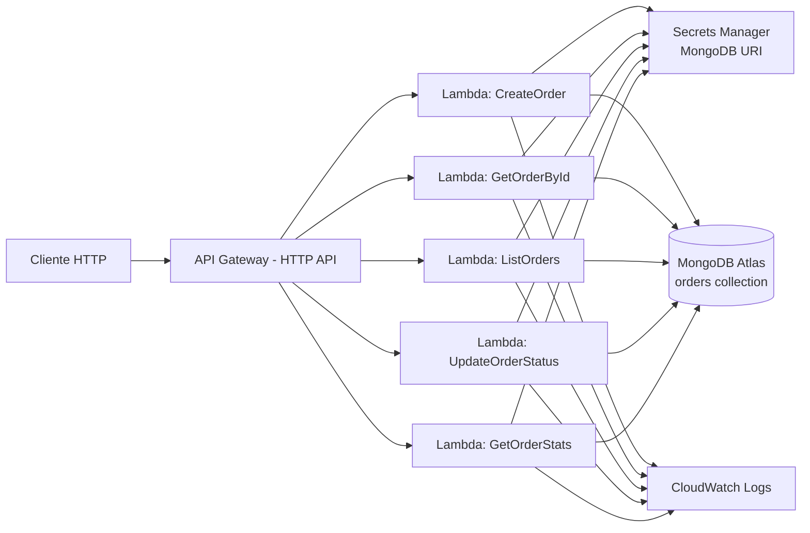

# Design Document — Orders API

## Overview

A Orders API é uma aplicação serverless. O cliente HTTP chama o API Gateway (HTTP API, mais simples e barato que REST API — equivalente conceitualmente a um "roteador gerenciado" que você já conhece de outros contextos), que invoca uma função Lambda por endpoint. Cada Lambda executa um caso de uso da camada de aplicação, que por sua vez usa um repositório para ler/escrever no MongoDB Atlas.

Ambiente de desenvolvimento: Node.js 24.x (versão instalada na máquina do usuário). Runtime de deploy na Lambda: **nodejs22.x** (nodejs24.x ainda não é GA como runtime gerenciado da Lambda no momento deste projeto — ver decisão em "Decisões de Design e Trade-offs").

## Architecture

### Visão Geral da Arquitetura



Fluxo típico de uma requisição:
1. API Gateway recebe a requisição HTTP e invoca a Lambda mapeada para a rota.
2. O handler faz o parsing do evento (`APIGatewayProxyEventV2`), loga o início, e chama o caso de uso correspondente.
3. O caso de uso usa `OrderRepository` (interface de domínio) para consultar/persistir dados.
4. A implementação concreta (`MongoOrderRepository`) obtém a conexão (URI vinda do Secrets Manager, cacheada entre invocações) e executa a operação no MongoDB Atlas.
5. O handler traduz o resultado (ou erro) em uma resposta HTTP, loga a conclusão/erro, e retorna.

### Estrutura de Pastas (DDD)

```
src/
  domain/
    order.ts            # Entity/Aggregate Root Order + regras de criação e transição
    item.ts              # Value Object Item
    order-status.ts      # União de tipos OrderStatus + regras de transição
    order-repository.ts  # Interface OrderRepository
    errors.ts            # Erros de domínio (ValidationError, InvalidTransitionError)
  application/
    create-order.ts
    get-order-by-id.ts
    list-orders.ts
    update-order-status.ts
    get-order-stats.ts
  infrastructure/
    mongo-order-repository.ts  # Implementa OrderRepository usando o driver oficial mongodb
    mongo-client.ts             # Conexão/cache do client MongoDB
    secrets.ts                  # Leitura da URI via Secrets Manager SDK
  handlers/
    create-order-handler.ts
    get-order-by-id-handler.ts
    list-orders-handler.ts
    update-order-status-handler.ts
    get-order-stats-handler.ts
```

Responsabilidade de cada camada:

- **domain**: contém `Order` (entity/aggregate root) e `Item` (value object), a máquina de transições de `OrderStatus`, e a interface `OrderRepository`. Não importa nada de `infrastructure` nem qualquer driver de banco. É o único lugar onde vivem cálculo de total, validação de criação e regras de transição de status (Requisitos 2, 3, 10.2, 10.3).
- **application**: um caso de uso por operação de negócio (`CreateOrder`, `GetOrderById`, `ListOrders`, `UpdateOrderStatus`, `GetOrderStats`). Cada caso de uso depende apenas de `OrderRepository` (interface) e das entidades de `domain` — nunca de `infrastructure` (Requisito 10.5).
- **infrastructure**: `MongoOrderRepository`, que implementa `OrderRepository` usando o driver oficial `mongodb` (sem ORM/ODM), a conexão com o MongoDB Atlas, e o acesso ao Secrets Manager para obter a URI (Requisitos 10.4, 15.2).
- **handlers**: um handler Lambda por endpoint. Cada handler faz parsing do evento do API Gateway, chama exatamente um caso de uso, trata erros mapeando-os para status HTTP, formata a resposta, e loga início/fim/erro (Requisito 10.6, 16). Os handlers nunca duplicam regra de negócio.

## Components and Interfaces

### Casos de Uso

```typescript
// application/create-order.ts
export interface CreateOrderInput {
  readonly customerId: string;
  readonly items: readonly { productId: string; quantity: number; unitPrice: number }[];
}
export class CreateOrder {
  constructor(private readonly repo: OrderRepository) {}
  async execute(input: CreateOrderInput): Promise<Order> {
    // gera id (uuid), chama Order.create, repo.save, retorna o Order criado
  }
}

// application/get-order-by-id.ts
export class GetOrderById {
  constructor(private readonly repo: OrderRepository) {}
  async execute(id: string): Promise<Order | null> {
    // repo.findById(id)
  }
}

// application/list-orders.ts
export class ListOrders {
  constructor(private readonly repo: OrderRepository) {}
  async execute(filter: OrderFilter): Promise<Order[]> {
    // repo.find(filter); ordenação por createdAt é responsabilidade do repositório
  }
}

// application/update-order-status.ts
export class UpdateOrderStatus {
  constructor(private readonly repo: OrderRepository) {}
  async execute(id: string, next: OrderStatus): Promise<Order> {
    // busca via findById; lança NotFoundError de aplicação se null
    // order.transitionTo(next) (lança InvalidTransitionError se inválida)
    // repo.update(order); retorna o Order atualizado
  }
}

// application/get-order-stats.ts
export class GetOrderStats {
  constructor(private readonly repo: OrderRepository) {}
  async execute(): Promise<OrderStat[]> {
    // repo.getStats()
  }
}
```

Todos os casos de uso dependem apenas de `OrderRepository` — em teste unitário, injeta-se `InMemoryOrderRepository`; em produção, `MongoOrderRepository`.

### Repositório MongoDB

O formato do documento persistido e as interfaces de domínio correspondentes estão descritos em [Data Models](#data-models). Esta subseção cobre a estratégia de identificação, os índices e o pipeline de agregação usados pela implementação `MongoOrderRepository`.

#### Estratégia de id

Decisão: o `id` do domínio (gerado como UUID v4 na aplicação, em `CreateOrder`) é usado diretamente como `_id` do documento, em vez de deixar o `ObjectId` do MongoDB ser gerado automaticamente.

Justificativa: o Requisito 9.1 exige que "não existam dois documentos com o mesmo valor de id" — usar `_id` para isso aproveita o índice único que o MongoDB já cria automaticamente sobre `_id`, sem precisar de um índice único adicional sobre um campo separado. Também evita manter dois identificadores (um de domínio, outro de infraestrutura) para a mesma entidade, o que manteria o domínio mais simples e a entidade referenciável pelo mesmo id em toda a stack (URL da API, logs, documento Mongo).

#### Índices

| Índice | Campos | Motivo |
|---|---|---|
| Único (automático) | `_id` | Garante unicidade do id do Order (Requisito 9.1) |
| `idx_customerId` | `{ customerId: 1 }` | Suporta `GET /orders?customerId=...` (Requisito 9.2) |
| `idx_status` | `{ status: 1 }` | Suporta `GET /orders?status=...` (Requisito 9.3) |
| `idx_customerId_status` | `{ customerId: 1, status: 1 }` | Suporta filtro combinado (Requisito 9.5, 6.4) |

Os índices são criados via script de setup (`npm run setup:indexes`, usando `createIndex` do driver) executado uma vez contra o cluster do Atlas — não fazem parte do template SAM, pois SAM não provisiona recursos do MongoDB Atlas.

#### Pipeline de agregação (`GET /orders/stats`)

```javascript
[
  {
    $group: {
      _id: "$status",
      count: { $sum: 1 },
      totalSum: { $sum: "$total" }
    }
  },
  {
    $project: {
      _id: 0,
      status: "$_id",
      count: 1,
      totalSum: { $round: ["$totalSum", 2] }
    }
  }
]
```

Isso satisfaz o Requisito 8.3: a agregação (contagem e soma por status) é feita inteiramente pelo MongoDB via `$group`, sem carregar todos os documentos para a aplicação.

### Contrato da API HTTP

#### POST /orders

- **Request body**: `{ "customerId": string, "items": [{ "productId": string, "quantity": number, "unitPrice": number }] }`
- **Sucesso**: `201`, body = Order criado (`id, customerId, items, status, total, createdAt`)
- **Erros**:
  - `400` — corpo ausente/malformado, `customerId` ausente/vazio/não-string, `items` ausente/vazio, ou item com `productId`/`quantity`/`unitPrice` inválidos
  - `500` — falha de persistência no MongoDB

#### GET /orders/{id}

- **Path param**: `id` (string)
- **Sucesso**: `200`, body = Order completo
- **Erros**:
  - `400` — `id` vazio ou fora do formato esperado (UUID)
  - `404` — `id` bem formado mas inexistente

#### GET /orders

- **Query params (opcionais)**: `customerId` (string), `status` (`OrderStatus`)
- **Sucesso**: `200`, body = array de Orders, ordenado por `createdAt` ascendente (array vazio se nada corresponder)
- **Erro**:
  - `400` — `status` informado fora do enum válido

#### PATCH /orders/{id}/status

- **Path param**: `id`
- **Request body**: `{ "status": OrderStatus }`
- **Sucesso**: `200`, body = Order atualizado
- **Erros**:
  - `404` — `id` inexistente (verificado antes de validar o corpo)
  - `400` — `status` ausente, fora do enum, ou transição inválida para o status atual

#### GET /orders/stats

- **Sucesso**: `200`, body = `[{ status, count, totalSum }]` (array vazio se a collection estiver vazia)

## Data Models

### Modelo de Domínio (TypeScript)

```typescript
// domain/order-status.ts
export type OrderStatus = "PENDING" | "CONFIRMED" | "SHIPPED" | "CANCELED";

const VALID_TRANSITIONS: Record<OrderStatus, readonly OrderStatus[]> = {
  PENDING: ["CONFIRMED", "CANCELED"],
  CONFIRMED: ["SHIPPED"],
  SHIPPED: [],
  CANCELED: [],
};

export function canTransition(from: OrderStatus, to: OrderStatus): boolean {
  return VALID_TRANSITIONS[from].includes(to);
}

// domain/item.ts
export interface Item {
  readonly productId: string;
  readonly quantity: number;
  readonly unitPrice: number;
}

// domain/errors.ts
export class ValidationError extends Error {}
export class InvalidTransitionError extends Error {}

// domain/order.ts
export interface OrderProps {
  readonly id: string;
  readonly customerId: string;
  readonly items: readonly Item[];
  readonly status: OrderStatus;
  readonly total: number;
  readonly createdAt: Date;
}

export class Order {
  private constructor(private readonly props: OrderProps) {}

  static create(input: { id: string; customerId: string; items: readonly Item[] }): Order {
    // valida customerId, items não vazio, e cada Item (productId, quantity, unitPrice)
    // lança ValidationError em qualquer violação (Requisito 2.4-2.8)
    // calcula total = round2(sum(quantity * unitPrice))
    // retorna Order com status "PENDING" e createdAt = new Date()
  }

  static fromPersistence(props: OrderProps): Order {
    // reconstrói um Order já existente, sem revalidar regras de criação
  }

  transitionTo(next: OrderStatus): Order {
    // usa canTransition(this.props.status, next); lança InvalidTransitionError se inválido
    // retorna uma nova instância de Order com o status atualizado (imutabilidade)
  }

  toProps(): OrderProps {
    return this.props;
  }
}

// domain/order-repository.ts
export interface OrderFilter {
  readonly customerId?: string;
  readonly status?: OrderStatus;
}

export interface OrderStat {
  readonly status: OrderStatus;
  readonly count: number;
  readonly totalSum: number;
}

export interface OrderRepository {
  save(order: Order): Promise<void>;
  findById(id: string): Promise<Order | null>;
  find(filter: OrderFilter): Promise<Order[]>;
  update(order: Order): Promise<void>;
  getStats(): Promise<OrderStat[]>;
}
```

Observações de design:
- `Order.create` é o único ponto de entrada para criação — não existe construtor público, então é impossível construir um `Order` inválido em qualquer parte do código (equivalente a uma constraint de banco relacional, mas garantida em memória).
- `transitionTo` retorna uma nova instância em vez de mutar `this`, o que facilita testar que "o estado permanece inalterado após rejeição" (Requisito 3.5-3.7): se lançar erro, a instância original nunca é tocada.
- `save` é usado para inserção (Requisito 4.1) e `update` para persistir a transição de status (Requisito 7.1); ambos operam sobre o mesmo documento, mas são separados na interface para deixar explícita a intenção de cada caso de uso.

### Formato do Documento MongoDB (collection `orders`)

```json
{
  "_id": "3fa1a1d2-...",
  "customerId": "cust-123",
  "items": [
    { "productId": "prod-1", "quantity": 2, "unitPrice": 19.9 },
    { "productId": "prod-2", "quantity": 1, "unitPrice": 5.0 }
  ],
  "status": "PENDING",
  "total": 44.8,
  "createdAt": "2025-01-15T10:30:00.000Z"
}
```

O mapeamento entre `OrderProps` (domínio) e o documento persistido é direto: `id` do domínio é armazenado como `_id` (ver "Estratégia de id" em [Components and Interfaces](#components-and-interfaces)), e os demais campos têm nomes e tipos idênticos, com `createdAt` serializado como string ISO 8601 pelo driver do MongoDB.

## Error Handling

Os dois erros de domínio (`ValidationError`, `InvalidTransitionError`, definidos em `domain/errors.ts`) e o erro de aplicação `NotFoundError` (lançado por `UpdateOrderStatus` e usado implicitamente por `GetOrderById` ao retornar `null`) são mapeados para status HTTP de forma consistente em todos os handlers:

| Erro | Origem | Status HTTP | Handlers afetados |
|---|---|---|---|
| `ValidationError` | `Order.create` (customerId/items/item inválidos), validação de query params (`status` fora do enum) | `400` | `create-order`, `list-orders`, `update-order-status` |
| `InvalidTransitionError` | `Order.transitionTo` (transição não permitida pela máquina de estados) | `400` | `update-order-status` |
| `NotFoundError` (aplicação) | `GetOrderById`/`UpdateOrderStatus` quando `findById` retorna `null` | `404` | `get-order-by-id`, `update-order-status` |
| Erro malformado de request (JSON inválido, `id`/path param vazio ou fora do formato UUID) | Parsing do handler, antes de chamar o caso de uso | `400` | todos |
| Qualquer outro erro não tratado (ex: falha de conexão/persistência no MongoDB, falha ao obter o secret) | `MongoOrderRepository`, `infrastructure/secrets.ts` | `500` | todos |

Regras gerais de tratamento de erro, comuns a todos os handlers:

1. Cada handler executa a chamada ao caso de uso dentro de um `try/catch`. O `catch` inspeciona o tipo do erro (`instanceof ValidationError`, `instanceof InvalidTransitionError`, `instanceof NotFoundError`) para decidir o status HTTP; qualquer erro não reconhecido cai no branch de `500`.
2. Antes de montar a resposta de erro, o handler registra uma mensagem de log (`{ "event": "handler.error", "errorType": ..., "statusCode": ... }`) — ver [Logging](#logging) — garantindo que toda falha seja rastreável via CloudWatch Logs Insights (Requisito 16.3).
3. Erros de validação (`400`) nunca chegam a acionar `repo.save`/`repo.update`: a validação ocorre inteiramente na camada de domínio (`Order.create`, `Order.transitionTo`) antes de qualquer chamada ao repositório, garantindo que nenhum estado inválido seja persistido.
4. Mensagens de erro no corpo da resposta HTTP descrevem o campo/motivo da falha (ex: `"customerId is required"`), mas nunca expõem detalhes internos de infraestrutura (stack traces, credenciais, URIs de conexão) — especialmente relevante para falhas ao obter a URI do MongoDB via Secrets Manager (Requisito 15.4).
5. Falhas na própria função de log (ex: `console.log` lançando por algum motivo excepcional) são isoladas em `try/catch` no wrapper de log, para nunca impedir o envio da resposta de erro ao chamador (Requisito 16.5).

## Estratégia de Testes

### Testes unitários (domínio e aplicação)

- `InMemoryOrderRepository`: implementação Fake de `OrderRepository` usando um array/Map em memória, implementando todas as operações da interface (`save`, `findById`, `find`, `update`, `getStats`, com filtragem e agregação replicadas em JS puro). Usada em todos os testes de casos de uso (Requisito 11.5), sem qualquer conexão com o MongoDB.
- Testes de `Order` (criação, cálculo de total, transições) não dependem de nenhum repositório — testam a classe de domínio isoladamente.

### Estrutura de pastas de teste

```
tests/
  unit/
    domain/
      order.test.ts
    application/
      create-order.test.ts
      get-order-by-id.test.ts
      list-orders.test.ts
      update-order-status.test.ts
      get-order-stats.test.ts
    fakes/
      in-memory-order-repository.ts
  integration/
    mongo-order-repository.test.ts
```

Scripts npm:
- `test:unit` → `jest --testPathPattern=tests/unit`
- `test:integration` → `jest --testPathPattern=tests/integration --runInBand`

### Testes de integração (MongoOrderRepository)

- Banco de dados MongoDB de teste dedicado (cluster/database distinto do usado em produção), com a URI de teste vinda de variável de ambiente local (`.env.test`, nunca commitado).
- Cada arquivo de teste de integração limpa a collection usada (`deleteMany({})`) em um `afterEach`/`afterAll`, garantindo execuções determinísticas (Requisito 12.4).
- `--runInBand` evita concorrência entre testes que compartilham a mesma collection de teste.
- Cobre: `insertOne` (via `save`), `findOne` (via `findById`), `find` com filtros combinados, `updateOne` (via `update`), e o pipeline de agregação de `getStats`.

## Infraestrutura AWS via SAM

Recursos principais do `template.yaml`:

```yaml
Resources:
  OrdersHttpApi:
    Type: AWS::Serverless::HttpApi

  CreateOrderFunction:
    Type: AWS::Serverless::Function
    Properties:
      Runtime: nodejs22.x
      Handler: create-order-handler.handler
      Environment:
        Variables:
          MONGODB_SECRET_NAME: !Ref MongoDbSecretName
      Policies:
        - Statement:
            - Effect: Allow
              Action: secretsmanager:GetSecretValue
              Resource: !Ref MongoDbSecretArn
      Events:
        Api:
          Type: HttpApi
          Properties:
            ApiId: !Ref OrdersHttpApi
            Path: /orders
            Method: post

  # GetOrderByIdFunction, ListOrdersFunction, UpdateOrderStatusFunction, GetOrderStatsFunction
  # seguem o mesmo padrão, cada uma com sua própria rota e sua própria Policy
  # restrita ao mesmo secret (leitura) + permissão padrão de CloudWatch Logs
  # (concedida automaticamente pelo SAM via AWSLambdaBasicExecutionRole)
```

Cada função tem sua própria IAM Role (gerada automaticamente pelo SAM a partir das `Policies` declaradas), restrita a:
- `secretsmanager:GetSecretValue` apenas sobre o ARN do secret específico da URI do MongoDB (sem wildcard).
- Permissão de escrita em CloudWatch Logs, concedida pela role básica de execução padrão do SAM (sem permissões adicionais).

Variáveis de ambiente: `MONGODB_SECRET_NAME` (ou `MONGODB_SECRET_ARN`), usada por `infrastructure/secrets.ts` para saber qual secret buscar.

### Estratégia de build: esbuild

Decisão: usar `esbuild` (via `sam build` com `BuildMethod: esbuild` no `Metadata` de cada função) em vez de `tsc` puro para empacotar cada Lambda.

Justificativa: esbuild compila e empacota (bundling) em um único arquivo JS otimizado, resolvendo imports e eliminando código não utilizado (tree-shaking) — o que reduz o tamanho do pacote de deploy e o cold start. `tsc` sozinho apenas transpila arquivo por arquivo, mantendo a estrutura de `node_modules` completa no pacote, o que deixaria o deploy mais pesado sem necessidade, já que este projeto não tem dependências nativas que exijam tratamento especial.

## Gestão de Configuração e Segredos

- **Produção**: a URI do MongoDB Atlas fica armazenada em um secret do AWS Secrets Manager. `infrastructure/secrets.ts` usa o `@aws-sdk/client-secrets-manager` para buscar o valor em tempo de execução, com cache em variável de módulo (sobrevive entre invocações warm da mesma execution environment da Lambda, evitando chamadas repetidas ao Secrets Manager).
- **Local**: um arquivo `.env` (nunca commitado — listado em `.gitignore`) define `MONGODB_URI` para execução local (`sam local` ou scripts de teste). `infrastructure/mongo-client.ts` decide a origem da URI: se `MONGODB_SECRET_NAME` estiver definido (ambiente Lambda), busca no Secrets Manager; caso contrário, usa `process.env.MONGODB_URI` carregado via `dotenv`.
- Se a busca no Secrets Manager falhar, o erro é logado sem incluir a credencial, e a operação retorna erro ao chamador sem tentar conectar ao MongoDB (Requisito 15.4).

## Logging

Cada handler registra, no mínimo:
- **Início**: `{ "event": "handler.start", "method": "POST", "path": "/orders" }`
- **Conclusão (sucesso)**: `{ "event": "handler.success", "orderId": "<id>" }`
- **Erro**: `{ "event": "handler.error", "errorType": "ValidationError", "statusCode": 400 }`

Mensagens são objetos serializados em JSON via `console.log`/`console.error`, o que o runtime da Lambda já envia automaticamente para o CloudWatch Logs (grupo de log criado automaticamente por função, `/aws/lambda/<nome-da-função>`). Nenhuma biblioteca de logging estruturado adicional é necessária para o escopo deste projeto — `console.log` com JSON já é "structured enough" para consulta via CloudWatch Logs Insights. Falha ao logar (ex: `console.log` lançando por algum motivo excepcional) é isolada em `try/catch` no wrapper de log, para nunca interromper a resposta ao chamador (Requisito 16.5).

## Pipeline de CI/CD

### buildspec.yml (CodeBuild)

```yaml
version: 0.2
phases:
  install:
    commands:
      - npm ci
  build:
    commands:
      - npm run lint
      - npm run typecheck
      - npm run test:unit
      - sam validate
      - sam build
      - sam deploy --no-confirm-changeset --no-fail-on-empty-changeset
artifacts:
  files:
    - '**/*'
```

Qualquer falha em uma dessas etapas interrompe o build e impede o deploy (Requisito 18.3), preservando a última versão implantada com sucesso.

### Estrutura da pipeline (CodePipeline)

- **Source stage**: origem no repositório GitHub via CodeConnections (branch `main`), disparando a pipeline automaticamente a cada push.
- **Build/Deploy stage**: uma única ação CodeBuild executando o `buildspec.yml` acima — que já cobre lint, typecheck, testes unitários, e finaliza com `sam validate` + `sam build` + `sam deploy` direto no ambiente único (`Deploy_DEV`), sem etapa de aprovação manual.

### Decisão: pipeline configurada via Console, não via IaC

Decisão: a CodeConnections, o CodePipeline e o projeto CodeBuild serão criados manualmente pelo Console da AWS nesta primeira versão, em vez de serem definidos como código (CloudFormation/CDK/SAM).

Justificativa: a etapa de autorização da CodeConnections com o GitHub exige uma ação manual no navegador (Requisito 17.2/17.3) que não pode ser automatizada via IaC de qualquer forma — isso reduz o ganho de definir o restante da pipeline como código. Para um projeto educacional de escopo único (um ambiente, uma pipeline, sem múltiplos ambientes a replicar), configurar manualmente é mais direto para aprendizado passo a passo, evitando introduzir uma segunda ferramenta de IaC (CDK/CloudFormation puro) só para a pipeline, quando o SAM já cobre a infraestrutura da aplicação. Se o projeto evoluir para múltiplos ambientes, essa decisão deve ser revisitada.

## Decisões de Design e Trade-offs

| Decisão | Alternativa considerada | Motivo da escolha |
|---|---|---|
| Items embutidos no documento Order | Items em collection separada, referenciados por `orderId` | Items não têm identidade própria fora do Order (são Value Objects) e são sempre lidos/escritos junto com o Order — embedding evita joins/lookups e reflete o padrão "os dados que são acessados juntos ficam armazenados juntos" do MongoDB |
| `_id` = id de domínio (UUID) | `_id` = `ObjectId` gerado pelo Mongo, com campo `id` separado | Evita manter dois identificadores para a mesma entidade e reaproveita o índice único automático de `_id` para garantir a unicidade exigida no Requisito 9.1 |
| esbuild para bundling da Lambda | `tsc` puro | Bundle único, menor, com tree-shaking; reduz tamanho de deploy e cold start sem necessidade de lidar com dependências nativas |
| Runtime `nodejs22.x` | `nodejs24.x` | `nodejs24.x` ainda não está disponível como runtime gerenciado da Lambda; `nodejs22.x` é o runtime LTS mais recente suportado. O ambiente de desenvolvimento local pode usar Node 24 sem conflito, já que o bundle gerado pelo esbuild é compatível com o runtime de destino configurado no build |
| Testes de integração fora da pipeline inicial | Incluir testes de integração no CodeBuild | Testes de integração dependem de um MongoDB de teste acessível pela rede do CodeBuild e são mais lentos/instáveis para rodar em todo push; nesta primeira versão, a pipeline roda apenas testes unitários (Requisito 12.6), e os testes de integração são executados manualmente/localmente |
| Pipeline configurada via Console | Pipeline definida via CDK/CloudFormation | A autorização da CodeConnections exige passo manual no GitHub de qualquer forma; para um único ambiente, a configuração manual é suficiente e evita introduzir uma ferramenta de IaC adicional só para a pipeline |

## Correctness Properties

*A property é uma característica ou comportamento que deve se manter verdadeiro em todas as execuções válidas do sistema — uma afirmação formal sobre o que o sistema deve fazer. As properties servem de ponte entre a especificação legível por humanos e garantias de correção verificáveis automaticamente.*

### Property 1: Cálculo do total na criação

Para qualquer lista não vazia de Item válidos (productId não vazio, quantity inteiro positivo, unitPrice número finito >= 0) e qualquer customerId não vazio, criar um Order a partir dessa lista deve produzir um Order com status `PENDING`, `createdAt` definido, e `total` igual à soma de `quantity * unitPrice` de cada item, arredondada para duas casas decimais.

**Validates: Requirements 2.3, 2.9**

### Property 2: Rejeição de customerId inválido

Para qualquer lista válida de Item, criar um Order com customerId ausente, vazio, ou composto apenas de espaços em branco deve ser rejeitado com um erro de validação, sem produzir uma instância de Order.

**Validates: Requirements 2.4**

### Property 3: Rejeição de lista de items vazia

Para qualquer customerId não vazio, criar um Order com uma lista vazia de items deve ser rejeitado com um erro de validação, sem produzir uma instância de Order.

**Validates: Requirements 2.5**

### Property 4: Rejeição de item inválido

Para qualquer customerId não vazio e qualquer lista de items em que ao menos um item tenha productId ausente/vazio, ou quantity que não seja um inteiro positivo, ou unitPrice que não seja um número finito >= 0, a criação do Order deve ser rejeitada com um erro de validação, sem produzir uma instância de Order.

**Validates: Requirements 2.6, 2.7, 2.8**

### Property 5: Máquina de estados de transição

Para qualquer Order e qualquer status de destino solicitado, a transição deve ser aceita (produzindo um Order com o novo status) se e somente se o par (status atual, status de destino) pertencer ao conjunto de transições válidas definidas (PENDING→CONFIRMED, PENDING→CANCELED, CONFIRMED→SHIPPED); em qualquer outro caso — incluindo status atuais terminais (SHIPPED, CANCELED) e solicitações para o mesmo status atual — a transição deve ser rejeitada com um erro, e o status do Order deve permanecer inalterado.

**Validates: Requirements 3.2, 3.3, 3.4, 3.5, 3.6, 3.7**

### Property 6: Criação via handler retorna 201 e persiste

Para qualquer corpo de requisição POST /orders válido (customerId não vazio como string, items válidos), o handler deve criar o Order, persisti-lo no repositório, e retornar status HTTP 201 com o Order criado no corpo da resposta.

**Validates: Requirements 4.1**

### Property 7: Payload inválido em POST /orders é rejeitado sem persistir

Para qualquer corpo de requisição POST /orders que viole as regras de criação do Order (corpo ausente/malformado, customerId ausente/vazio/não-string, items ausente/vazio, ou item inválido), o handler deve retornar status HTTP 400 com uma mensagem descrevendo o campo inválido, e nenhum Order deve ser persistido no repositório.

**Validates: Requirements 4.2, 4.3**

### Property 8: Handler de criação sempre loga início e conclusão

Para qualquer requisição POST /orders processada com sucesso, o handler deve registrar exatamente duas mensagens de log: uma no início contendo método e path, e outra na conclusão contendo o id do Order criado.

**Validates: Requirements 4.5, 16.1, 16.2**

### Property 9: Consulta por id existente retorna todos os atributos

Para qualquer Order armazenado no repositório, consultar por seu id deve retornar status HTTP 200 com um Order contendo exatamente os mesmos valores de id, customerId, items, status, total e createdAt do Order armazenado.

**Validates: Requirements 5.1**

### Property 10: Consulta por id inexistente retorna 404

Para qualquer id em formato válido que não corresponda a nenhum Order armazenado, o handler de consulta deve retornar status HTTP 404.

**Validates: Requirements 5.2**

### Property 11: Consulta por id malformado retorna 400

Para qualquer valor de id vazio ou fora do formato esperado, o handler de consulta deve retornar status HTTP 400, sem consultar o repositório.

**Validates: Requirements 5.3**

### Property 12: Listagem com filtros retorna o subconjunto correto e ordenado

Para qualquer conjunto de Orders armazenados e qualquer combinação de filtros opcionais (customerId, status, ambos, ou nenhum), o handler de listagem deve retornar, com status HTTP 200, exatamente os Orders cujo customerId (quando informado) corresponda exatamente ao valor informado e cujo status (quando informado) corresponda exatamente ao valor informado, ordenados por createdAt em ordem crescente — incluindo uma lista vazia quando nenhum Order satisfizer os filtros ou o repositório estiver vazio.

**Validates: Requirements 6.1, 6.2, 6.3, 6.4, 6.6, 6.7**

### Property 13: Filtro de status inválido retorna 400

Para qualquer valor de status informado como filtro que não pertença ao conjunto de valores válidos de OrderStatus, o handler de listagem deve retornar status HTTP 400.

**Validates: Requirements 6.5**

### Property 14: Atualização de status válida persiste e retorna 200

Para qualquer Order armazenado e qualquer status de destino que represente uma transição válida a partir do status atual desse Order, o handler de atualização deve persistir o novo status e retornar status HTTP 200 com o Order atualizado.

**Validates: Requirements 7.1**

### Property 15: Atualização em id inexistente retorna 404 independente do corpo

Para qualquer id que não exista no repositório e qualquer conteúdo de corpo de requisição (incluindo corpos malformados), o handler de atualização de status deve retornar status HTTP 404.

**Validates: Requirements 7.2**

### Property 16: Atualização inválida em id existente retorna 400 sem modificar

Para qualquer Order armazenado e qualquer solicitação de atualização de status em que o campo status esteja ausente, não corresponda a um OrderStatus válido, ou represente uma transição inválida a partir do status atual desse Order, o handler deve retornar status HTTP 400, e o status persistido do Order não deve ser alterado.

**Validates: Requirements 7.3**

### Property 17: Estatísticas agregam corretamente por status

Para qualquer conjunto de Orders armazenados, o resultado de /orders/stats deve conter, para cada status com ao menos um Order associado, a contagem exata de Orders daquele status e a soma exata dos valores de total desses Orders (com a mesma precisão de duas casas decimais), e nenhuma entrada para status sem nenhum Order associado — incluindo uma lista vazia quando o repositório estiver vazio.

**Validates: Requirements 8.1, 8.2**

### Property 18: Log de erro descreve tipo e status HTTP

Para qualquer requisição que resulte em erro em qualquer handler, deve ser registrada uma mensagem de log contendo o tipo do erro e o status HTTP retornado, antes da resposta de erro ser enviada.

**Validates: Requirements 16.3**

## Testing Strategy

- **Testes unitários** (Jest, `tests/unit`): cobrem as Properties 1-18 acima usando `InMemoryOrderRepository`, além de casos de exemplo específicos (falha de persistência → 500, falha ao obter secret → erro sem credencial no log, falha de log não interrompe resposta).
- **Testes de propriedade**: implementados com `fast-check`, mínimo de 100 iterações por property, usando geradores para customerId, listas de Item, OrderStatus, e conjuntos de Orders.
- **Testes de integração** (Jest, `tests/integration`): validam `MongoOrderRepository` contra um MongoDB de teste real — inserção, busca com filtros, atualização, e o pipeline de agregação de stats — com 1-3 exemplos representativos por operação (não são properties, pois o alvo é a integração com o driver/banco, não a lógica de negócio).
- Cada teste de property deve referenciar a property do design document correspondente, usando o formato de tag: **Feature: orders-api, Property {número}: {texto da property}**.
